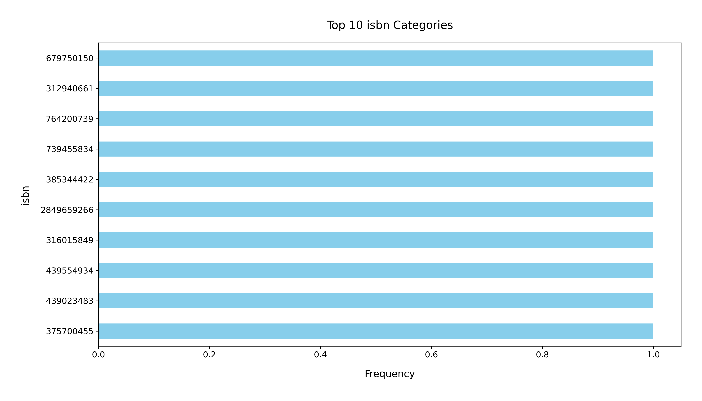

# Analysis Report

### Summary of the Goodreads Dataset

The dataset consists of 10,000 entries and 23 columns, providing a detailed overview of books available on Goodreads. Key attributes include book identifiers, author names, publication years, ratings, and the number of ratings.

#### Key Insights

1. **Missing Values**: 
   - The dataset has missing values in several columns, notably:
     - `isbn` (700 missing)
     - `isbn13` (585 missing)
     - `original_publication_year` (21 missing)
     - `original_title` (585 missing)
     - `language_code` (1084 missing)
   This indicates potential gaps in the data that may affect analyses, especially when evaluating book metadata.

2. **Author Popularity**: 
   - The most frequently occurring author is **Stephen King**, with 60 entries. This suggests a certain bias toward popular authors in the dataset.

3. **Publication Year**: 
   - The average original publication year is approximately **1982**, with a range from **-1750** to **2017**. This indicates that the dataset contains both classic and contemporary literature.

4. **Average Ratings**: 
   - The average rating across all books is **4.00**, with a standard deviation of about **0.25**. This suggests a general trend towards positive reviews among the books in the dataset.

5. **Ratings Distribution**:
   - The ratings breakdown indicates that the majority of books receive more ratings in the **4** and **5** star categories, with average counts of **19,965** for 4-star ratings and **23,789** for 5-star ratings. This highlights a tendency for books to be well-received.

6. **Language Distribution**: 
   - There are 25 unique language codes in the dataset, with **English** (eng) being the most frequent (6341 occurrences), indicating a strong focus on English literature.

7. **ISBN Availability**: 
   - A significant number of entries are missing ISBN and ISBN13 values, which could impact book identification and retrieval for further analysis.

### Recommendations

1. **Data Cleaning**: 
   - Address the missing values, particularly in critical fields such as `isbn`, `isbn13`, and `language_code`, to enhance the dataset's usability. Imputation or removal of incomplete entries may be necessary.

2. **Diversity in Authors**: 
   - Consider including a wider range of authors to provide a more balanced representation. This can help diversify the dataset and attract a broader audience.

3. **Explore Genre Information**: 
   - Adding genre information could provide deeper insights into the popularity and ratings of different types of literature.

4. **Analyze Ratings Trends**: 
   - A further breakdown of the ratings over time could reveal trends in reader preferences and shifts in literary popularity.

5. **Visualization**: 
   - Utilize visualizations such as histograms for rating distributions, bar charts for author frequency, and line charts for publication year trends to enhance understanding and presentation of the dataset.

6. **Expand to Other Languages**: 
   - Given the presence of multiple languages, consider expanding the dataset to include more international literature to widen the scope of analysis.

By implementing these recommendations and conducting more thorough analyses, valuable insights can be derived to enhance understanding and engagement with the literary community.

