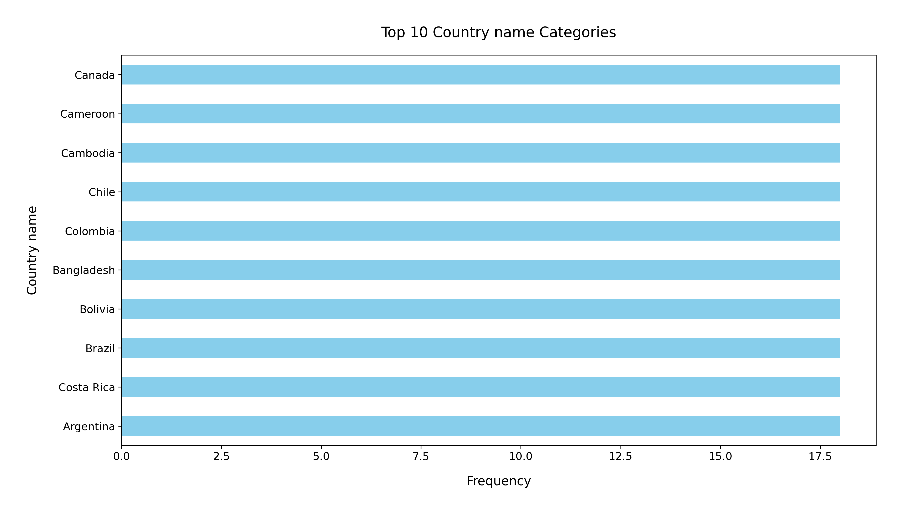

# Analysis Report

### Summary of the Happiness Dataset

The dataset `happiness.csv` consists of 2,363 entries and 11 attributes, capturing various factors related to happiness across different countries and years. The key columns include:

- **Country name**: Identifies the country.
- **Year**: Indicates the year of the data point.
- **Life Ladder**: A measure of subjective well-being.
- **Log GDP per capita**: Economic indicator.
- **Social support**: Reflects the perceived support in times of need.
- **Healthy life expectancy at birth**: Average number of years a newborn is expected to live in good health.
- **Freedom to make life choices**: Indicates personal freedom in decision-making.
- **Generosity**: Measures the willingness to give.
- **Perceptions of corruption**: Reflects the level of corruption perceived by the populace.
- **Positive affect**: Measures positive emotions experienced.
- **Negative affect**: Measures negative emotions experienced.

### Key Insights

1. **Missing Values**: The dataset has various missing values across several columns, with the most significant gaps in 'Generosity' (81 missing), 'Perceptions of corruption' (125 missing), and 'Healthy life expectancy at birth' (63 missing). This may impact analyses, especially when looking at correlations.

2. **Average Metrics**:
   - The average **Life Ladder** score is approximately **5.48**, indicating a moderate level of happiness across sampled countries.
   - The **mean Log GDP per capita** is around **9.40**, suggesting varied economic conditions among the countries represented.
   - **Social support** averages at **0.81**, indicating a generally high perception of social support.
   - **Healthy life expectancy** has an average of **63.40 years**, showing variability in health standards among countries.
   - **Freedom to make life choices** has a mean of **0.75**, reflecting a relatively high level of personal freedom in many countries.
   - The dataset shows a very low average for **Generosity**, which could indicate either cultural factors or the impact of economic conditions.

3. **Emotional Metrics**:
   - **Positive affect** has an average score of **0.65**, while the **Negative affect** averages at **0.27**, suggesting a generally positive emotional landscape among respondents.

### Recommendations

1. **Data Cleaning**: Address the missing values, especially in key variables that may impact findings, such as 'Generosity' and 'Perceptions of corruption'. Consider imputation techniques or removing records with excessive missing data based on the analysis needs.

2. **Exploratory Analysis**: Visualizations such as scatter plots for 'Log GDP per capita' versus 'Life Ladder' could reveal correlations between economic status and happiness levels. Box plots could also effectively show the distribution of happiness scores across different years or countries.

3. **Focus on Emotional Well-being**: Further research could explore the relationship between social support and emotional metrics ('Positive affect' and 'Negative affect') to identify potential interventions to boost happiness.

4. **Country-Specific Insights**: Analyze the dataset country by country to identify specific patterns or anomalies in happiness levels. This could guide policymakers in addressing local issues that hinder happiness.

5. **Longitudinal Studies**: Given the data spans multiple years, a time-series analysis could yield insights into how happiness factors have evolved and inform future projections.

By leveraging these insights and recommendations, stakeholders can better understand the dynamics of happiness and well-being across nations, ultimately guiding efforts to enhance quality of life.

