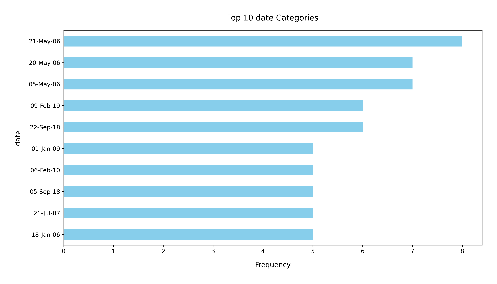

# Analysis Report

### Dataset Summary

The dataset `media.csv` consists of 2,652 entries and 8 columns, detailing various attributes of media items. The columns include:

- **date**: The release date of the media item.
- **language**: The language in which the media item is produced.
- **type**: The category of the media (e.g., movie, series).
- **title**: The title of the media item.
- **by**: The creator or author of the media.
- **overall**: An overall rating of the media item (scale: 1-5).
- **quality**: A rating on the quality of the media (scale: 1-5).
- **repeatability**: A rating indicating how likely viewers are to watch the media again (scale: 1-3).

#### Missing Values
The dataset contains some missing values:
- **date**: 99 missing entries.
- **by**: 262 missing entries.

#### Summary Statistics
Key statistics of the dataset reveal:
- **Overall Ratings**: The average overall rating is approximately 3.05 (with a standard deviation of 0.76), indicating generally positive reception.
- **Quality Ratings**: The average quality rating is about 3.21 (standard deviation of 0.80), suggesting that most media items are perceived as decent in quality.
- **Repeatability**: The average repeatability score is 1.49, indicating that most media items are not frequently watched again, as the maximum score is 3.

#### Insights
1. **Date Distribution**: With 2,553 valid date entries and 2055 unique dates, the dataset may contain a wide range of release years, which could be visualized in a time series chart to observe trends over time.
2. **Language**: English is the dominant language, comprising 49% (1,306) of the entries, followed by other languages. A pie chart could illustrate the distribution of media across different languages.
3. **Type of Media**: The dataset is predominantly composed of movies (2211 entries). A bar chart could help visualize the distribution of media types.
4. **Creators**: The presence of 1,528 unique creators highlights a diverse range of contributors, although a significant number of entries (262) are missing this information. An analysis could identify the most prolific creators.

#### Recommendations
- **Data Cleaning**: Address the missing values in the `date` and `by` columns. Consider imputing the `by` field with the mode or utilizing expert knowledge, especially for frequently rated items.
- **Explore Trends**: Conduct a time-series analysis of ratings to identify patterns and trends over the years, which could be beneficial for understanding shifts in viewer preferences.
- **Enhance Repeatability**: Investigate factors contributing to lower repeatability scores. Consider conducting surveys or focus groups to probe viewer motivations for re-watching media.
- **Marketing Strategies**: Given the high ratings, consider targeted marketing for well-rated media to encourage increased visibility and viewership.

Visual representations of these insights, such as histograms, pie charts, and bar graphs, could further enhance understanding and facilitate better decision-making based on the dataset.

